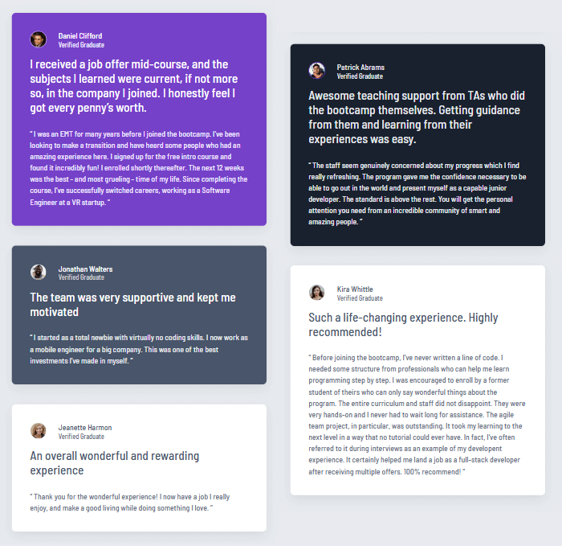
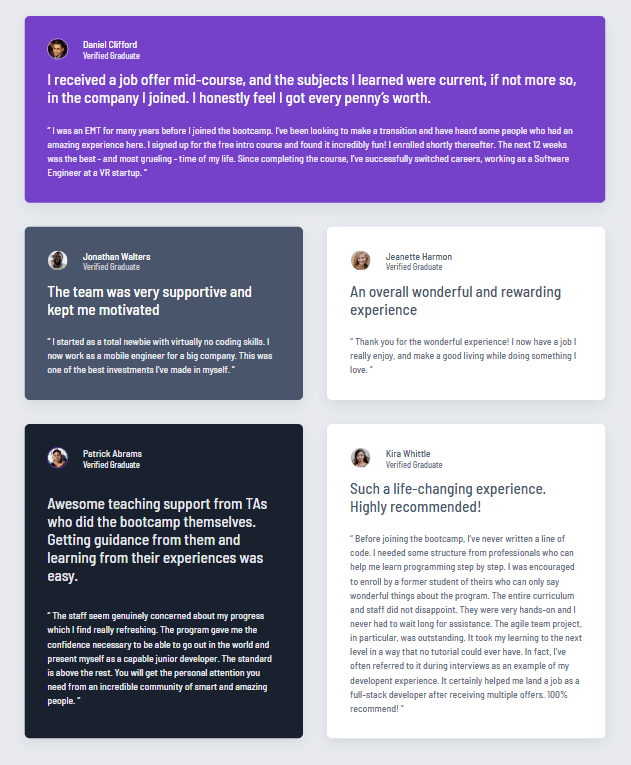
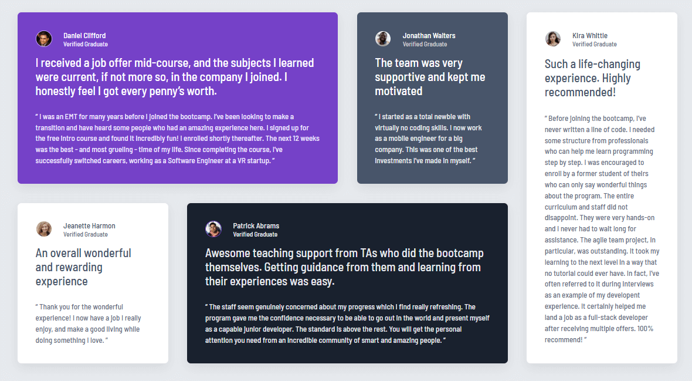

# Frontend Mentor - Testimonials grid section solution

This is a solution to the [Testimonials grid section challenge on Frontend Mentor](https://www.frontendmentor.io/challenges/testimonials-grid-section-Nnw6J7Un7). Frontend Mentor challenges help you improve your coding skills by building realistic projects.

## Table of contents

- [Overview](#overview)
  - [The Challenge](#the-challenge)
  - [Screenshot](#screenshot)
  - [Links](#links)
- [My process](#my-process)
  - [Built with](#built-with)
- [Author](#author)

## Overview

### The challenge

Users should be able to:

- View the optimal layout for the site depending on their device's screen size

### Screenshot

#### --- Small Screens ---

#### --- Medium Screens ---

#### --- Large Screens ---

### Links

- Solution URL: [Repository](https://github.com/amShuri/testimonials-grid-section)
- Live Site URL: [Live Site](https://amshuri.github.io/testimonials-grid-section/)

## My process

### Built with

- Semantic HTML5 markup
- CSS custom properties
- Flexbox
- CSS Grid
- Mobile-first workflow

## What I learned

I learned that media queries use the browser's default font size (usually 16px), not whatever you set in your CSS. [Source](https://drafts.csswg.org/mediaqueries/#units)

## Author

- GitHub - [amShuri](https://github.com/amShuri/)
- Frontend Mentor - [@amShuri](https://www.frontendmentor.io/profile/amShuri)
- Twitter - [@amShuri7](https://x.com/amshuri7)
